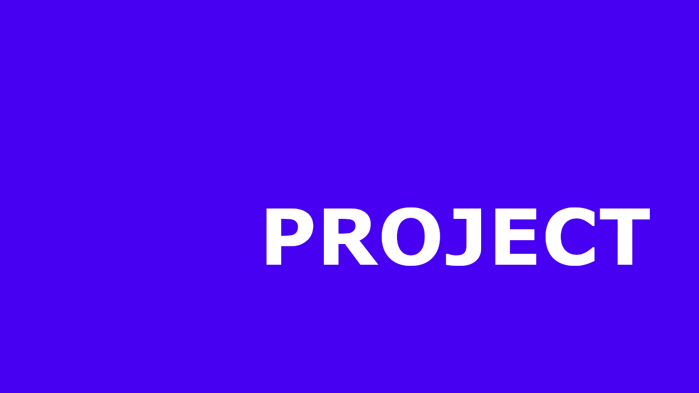
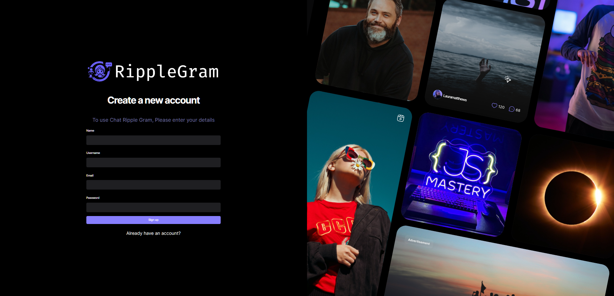
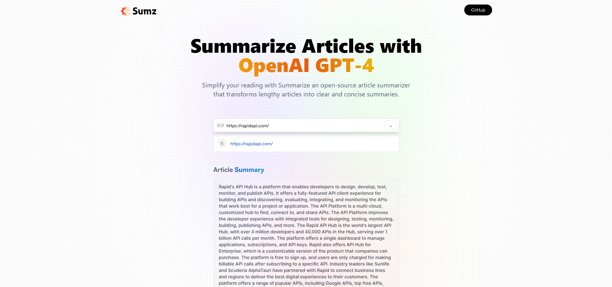
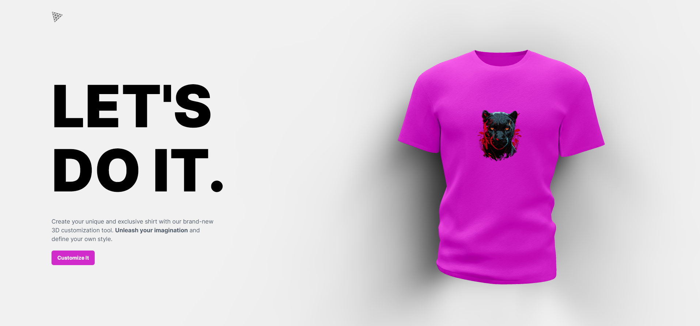
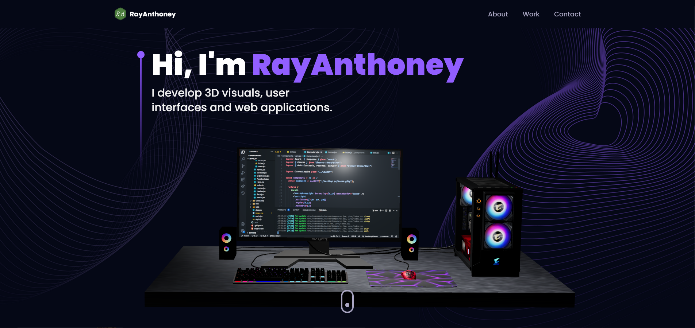
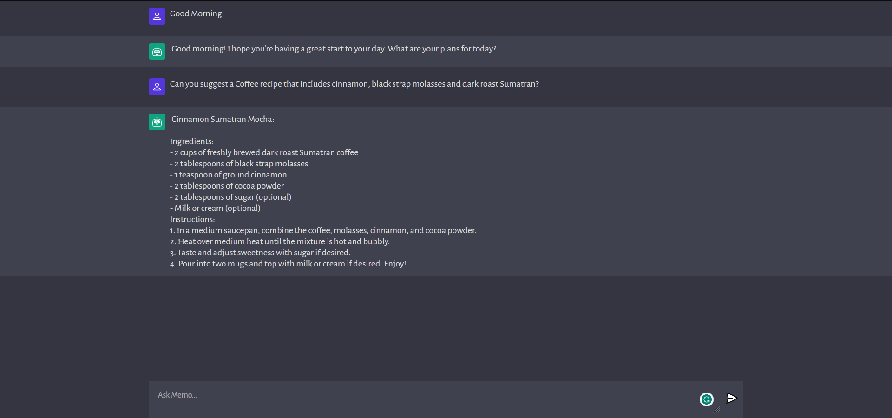
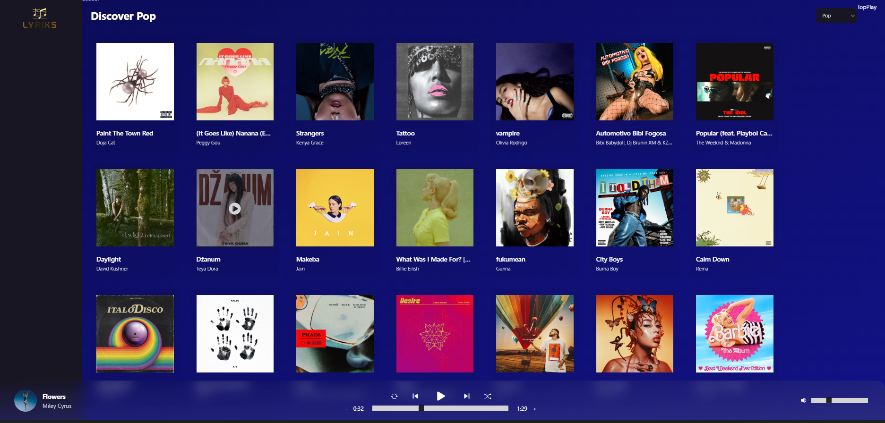

<!-- - #1 [Build and Deploy a Full Stack Social Media App | React JS, Appwrite, Tailwind CSS, React Query.](https://www.youtube.com/watch?v=_W3R2VwRyF4&t=3719s)
- #2 [Tailwind CSS Full Course 2023 | Build and Deploy a Nike Website.](https://www.youtube.com/watch?v=tS7upsfuxmo&t=3065s)
- #3 [Creating a Sushi-Themed Website: 2023 HTML & CSS Guide for Beginners](https://youtu.be/QRrPE9aj3wI?si=0nRUxjvvG0xCVPbr)
- #4 [Build and Deploy an AI-Powered 3D Website Using React | 2023 Three JS Course Tutorial.](https://www.youtube.com/watch?v=ZqEa8fTxypQ&t=1s)
- #5 [Build and Deploy a React Native App | 2023 React Native Course Tutorial for Beginners.](https://www.youtube.com/watch?v=mJ3bGvy0WAY)
- #6 [Build and Deploy an Amazing 3D Web Developer Portfolio in React JS | Beginner Three.JS Tutorial.](https://www.youtube.com/watch?v=0fYi8SGA20k&t=3673s)
- #7 [Build and Deploy a Full Stack MERN Application with CRUD, Auth and Charts...](https://www.youtube.com/watch?v=k4lHXIzCEkM&t=10130s)
- #8 [Build and Deploy a Full Stack MERN AI Image Generation App | Midjourney & DALL-E Clone](https://www.youtube.com/watch?v=EyIvuigqDoA&t=6970s)
- #9 [Build and Deploy Your Own ChatGPT AI App in JavaScript | OpenAI, Machine Learning.](https://www.youtube.com/watch?v=2FeymQoKvrk&t=183s)
- #10 [Build and Deploy a Better Spotify 2.0 Clone Musix App with React 18! (Tailwind, Redux, RapidAPI.)](https://www.youtube.com/watch?v=I1cpb0tYV74)
    - 
    - 
    -  -->

# JavaScriptMastery Labs
 
 

    

        
        <h3>JavaScript Mastery</h3>
    

    
voluptatum veritatis rem sequi repellat laboriosam voluptate beatae eligendi. Iure voluptates possimus tempora quibusdam, iste, similique consectetur dolor adipisci unde tempore temporibus debitis, aperiam a ut exercitationem soluta est. 

 

## Projects ::
<!--                    -->
<!-- Begin Project #1   -->
<!--                    -->
<h3 href="https://youtu.be/FkowOdMjvYo?si=wMOrUNdqOiXxQ4b8" align="left">#1 Build and Deploy an Amazing 3D Developer Portfolio in React with Three.js.</h3>

        <!-- link to project -->
    <a href='-URL TO DEMO GOES HERE-'>
    <!-- link to local image -->
        
    </a>

- [ ] Build and Deploy
  - [ ] Create a gif during navigation
  - [ ] >-PLACE YOUR TODO TASKS HERE-<
  - [ ] >-PLACE YOUR TODO TASKS HERE-<
  - [ ] >-PLACE YOUR TODO TASKS HERE-<
  
 

    

        
        
    

    <!-- 
The video is about building and deploying a social media app using <strong>React JS</strong>, <strong>Appwrite</strong>, <strong>Tailwind</strong> <strong>CSS</strong>, and <strong>React Query</strong>. The app promises a stunning UI with a native mobile feel, a hassle-free backend setup with Appwrite, and various features like authentication, infinite scroll, user profiles, and more.
 -->
    <h3>Watch the video tutorial here::</h3>
    

 

<!--                    -->
<!-- Begin Project #2   -->
<!--                    -->
<h3 href="https://www.youtube.com/@javascriptmastery" align="left">#2 Build and Deploy a Full Stack Social Media App | React JS, Appwrite, Tailwind CSS, React Query.</h3>

        <!-- link to project -->
    <a href='-URL TO DEMO GOES HERE-'>
    <!-- link to local image -->
        
    </a>

- [ ] Build and Deploy
  - [ ] Create a gif during navigation
  - [ ] >-PLACE YOUR TODO TASKS HERE-<
  - [ ] >-PLACE YOUR TODO TASKS HERE-<
  - [ ] >-PLACE YOUR TODO TASKS HERE-<
  
 

    

        
        
    

    
The video is about building and deploying a social media app using <strong>React JS</strong>, <strong>Appwrite</strong>, <strong>Tailwind</strong> <strong>CSS</strong>, and <strong>React Query</strong>. The app promises a stunning UI with a native mobile feel, a hassle-free backend setup with Appwrite, and various features like authentication, infinite scroll, user profiles, and more.

    <h3>Watch the video tutorial here::</h3>
    

 

<!--                    -->
<!-- Begin Project #3   -->
<!--                    -->
<h3 href="https://www.youtube.com/@javascriptmastery" align="left">#3 Tailwind CSS Full Course 2023 | Build and Deploy a Nike Website.</h3>

        <!-- link to project -->
    <a href='-URL TO DEMO GOES HERE-'>
    <!-- link to local image -->
        
    </a>

- [x] Build and Deploy
  - [ ] Create a gif during navigation
  - [ ] >-PLACE YOUR TODO TASKS HERE-<
  - [ ] >-PLACE YOUR TODO TASKS HERE-<
  - [ ] >-PLACE YOUR TODO TASKS HERE-<
  
 

    

        
        
    

    

  <strong>Tailwind CSS</strong> is a utility-first CSS framework that simplifies web development by providing a set of CSS utility classes. You can use the just-in-time (JIT) compiler in Tailwind CSS to create custom styles and classes as needed, ensuring a lean and efficient CSS bundle. Tailwind CSS supports various CSS properties for layout, positioning, and visibility, and you can easily apply these using utility classes.

    <h3>Watch the video tutorial here::</h3>
    

 

<!--                    -->
<!-- Begin Project #4   -->
<!--                    -->
<h3 href="https://www.youtube.com/@javascriptmastery" align="left">#4 Creating a Sushi-Themed Website: 2023 HTML & CSS Guide for Beginners</h3>

        <!-- link to project -->
    <a href='-URL TO DEMO GOES HERE-'>
    <!-- link to local image -->
        
    </a>

- [x] Build and Deploy 
  - [ ] Create a gif during navigation
  - [ ] >-PLACE YOUR TODO TASKS HERE-<
  - [ ] >-PLACE YOUR TODO TASKS HERE-<
  - [ ] >-PLACE YOUR TODO TASKS HERE-<
  
 

    

        
        
    

    
Lorem ipsum dolor sit amet consectetur adipisicing elit. Necessitatibus,
a ipsum. Eos, in iusto? Iste dolorum, tempore ipsam voluptates ex aspernatur
voluptatum veritatis rem sequi repellat laboriosam voluptate beatae eligendi. Iure voluptates possimus tempora quibusdam, iste, similique consectetur dolor adipisci unde tempore temporibus debitis, aperiam a ut exercitationem soluta est.    
    

    <h3>Watch the video tutorial here::</h3>
    

 

<!--                    -->
<!-- Begin Project #5   -->
<!--                    -->
<h3 href="https://www.youtube.com/@javascriptmastery" align="left">#5 Turning Your AI Application into a Profitable SaaS Business | AI Summarizer</h3>

        <!-- link to project -->
    <a href='-URL TO DEMO GOES HERE-'>
    <!-- link to local image -->
        
    </a>

- [x] Build and Deploy 
  - [ ] Create a gif during navigation
  - [ ] >-PLACE YOUR TODO TASKS HERE-<
  - [ ] >-PLACE YOUR TODO TASKS HERE-<
  - [ ] >-PLACE YOUR TODO TASKS HERE-<
  
 

    

        
        
    

    
Lorem ipsum dolor sit amet consectetur adipisicing elit. Necessitatibus,
a ipsum. Eos, in iusto? Iste dolorum, tempore ipsam voluptates ex aspernatur
voluptatum veritatis rem sequi repellat laboriosam voluptate beatae eligendi. Iure voluptates possimus tempora quibusdam, iste, similique consectetur dolor adipisci unde tempore temporibus debitis, aperiam a ut exercitationem soluta est.    
    

    <h3>Watch the video tutorial here::</h3>
    

 

<!--                    -->
<!-- Begin Project #6   -->
<!--                    -->
<h3 href="https://www.youtube.com/@javascriptmastery" align="left">#6 Build and Deploy an AI-Powered 3D Website Using React | 2023 Three JS Course Tutorial.</h3>

        <!-- link to project -->
    <a href='-URL TO DEMO GOES HERE-'>
    <!-- link to local image -->
        
    </a>

- [x] Build and Deploy
  - [ ] Create a gif during navigation
  - [ ] >-PLACE YOUR TODO TASKS HERE-<
  - [ ] >-PLACE YOUR TODO TASKS HERE-<
  - [ ] >-PLACE YOUR TODO TASKS HERE-<
  
 

    

        
        
    

    
Lorem ipsum dolor sit amet consectetur adipisicing elit. Necessitatibus,
a ipsum. Eos, in iusto? Iste dolorum, tempore ipsam voluptates ex aspernatur
voluptatum veritatis rem sequi repellat laboriosam voluptate beatae eligendi. Iure voluptates possimus tempora quibusdam, iste, similique consectetur dolor adipisci unde tempore temporibus debitis, aperiam a ut exercitationem soluta est.    
    

    <h3>Watch the video tutorial here::</h3>
    

 

<!--                    -->
<!-- Begin Project #7   -->
<!--                    -->
<h3 href="https://www.youtube.com/@javascriptmastery" align="left">#7 Build and Deploy a React Native App | 2023 React Native Course Tutorial for Beginners.</h3>

        <!-- link to project -->
    <a href='-URL TO DEMO GOES HERE-'>
    <!-- link to local image -->
        
    </a>

- [ ] Build and Deploy
  - [ ] Create a gif during navigation
  - [ ] >-PLACE YOUR TODO TASKS HERE-<
  - [ ] >-PLACE YOUR TODO TASKS HERE-<
  - [ ] >-PLACE YOUR TODO TASKS HERE-<
  
 

    

        
        
    

    
Lorem ipsum dolor sit amet consectetur adipisicing elit. Necessitatibus,
a ipsum. Eos, in iusto? Iste dolorum, tempore ipsam voluptates ex aspernatur
voluptatum veritatis rem sequi repellat laboriosam voluptate beatae eligendi. Iure voluptates possimus tempora quibusdam, iste, similique consectetur dolor adipisci unde tempore temporibus debitis, aperiam a ut exercitationem soluta est.    
    

    <h3>Watch the video tutorial here::</h3>
    

 

<!--                    -->
<!-- Begin Project #8   -->
<!--                    -->
<h3 href="https://www.youtube.com/@javascriptmastery" align="left">#8 Build and Deploy an Amazing 3D Web Developer Portfolio in React JS | Beginner Three.JS Tutorial.</h3>

        <!-- link to project -->
    <a href='-URL TO DEMO GOES HERE-'>
    <!-- link to local image -->
        
    </a>

- [x] Build and Deploy
  - [ ] Create a gif during navigation
  - [ ] >-PLACE YOUR TODO TASKS HERE-<
  - [ ] >-PLACE YOUR TODO TASKS HERE-<
  - [ ] >-PLACE YOUR TODO TASKS HERE-<
  
 

    

        
        
    

    
Lorem ipsum dolor sit amet consectetur adipisicing elit. Necessitatibus,
a ipsum. Eos, in iusto? Iste dolorum, tempore ipsam voluptates ex aspernatur
voluptatum veritatis rem sequi repellat laboriosam voluptate beatae eligendi. Iure voluptates possimus tempora quibusdam, iste, similique consectetur dolor adipisci unde tempore temporibus debitis, aperiam a ut exercitationem soluta est.    
    

    <h3>Watch the video tutorial here::</h3>
    

 

<!--                    -->
<!-- Begin Project #9   -->
<!--                    -->
<h3 href="https://www.youtube.com/@javascriptmastery" align="left">#9 Build and Deploy a Full Stack MERN Application with CRUD, Auth and Charts...</h3>

        <!-- link to project -->
    <a href='-URL TO DEMO GOES HERE-'>
    <!-- link to local image -->
        
    </a>

- [x] Build and Deploy
  - [ ] Create a gif during navigation
  - [ ] >-PLACE YOUR TODO TASKS HERE-<
  - [ ] >-PLACE YOUR TODO TASKS HERE-<
  - [ ] >-PLACE YOUR TODO TASKS HERE-<
  
 

    

        
        
    

    
Lorem ipsum dolor sit amet consectetur adipisicing elit. Necessitatibus,
a ipsum. Eos, in iusto? Iste dolorum, tempore ipsam voluptates ex aspernatur
voluptatum veritatis rem sequi repellat laboriosam voluptate beatae eligendi. Iure voluptates possimus tempora quibusdam, iste, similique consectetur dolor adipisci unde tempore temporibus debitis, aperiam a ut exercitationem soluta est.    
    

    <h3>Watch the video tutorial here::</h3>
    

 

<!--                    -->
<!-- Begin Project #10   -->
<!--                    -->
<h3 href="https://www.youtube.com/@javascriptmastery" align="left">#10 Build and Deploy a Full Stack MERN AI Image Generation App | Midjourney & DALL-E Clone</h3>

        <!-- link to project -->
    <a href='-URL TO DEMO GOES HERE-'>
    <!-- link to local image -->
        
    </a>

- [x] Build and Deploy an Amazing 3D Web Developer Portfolio in React JS | Beginner Three.js Tutorial
  - [ ] Create a gif during navigation
  - [ ] >-PLACE YOUR TODO TASKS HERE-<
  - [ ] >-PLACE YOUR TODO TASKS HERE-<
  - [ ] >-PLACE YOUR TODO TASKS HERE-<
  
 

    

        
        
    

    
Lorem ipsum dolor sit amet consectetur adipisicing elit. Necessitatibus,
a ipsum. Eos, in iusto? Iste dolorum, tempore ipsam voluptates ex aspernatur
voluptatum veritatis rem sequi repellat laboriosam voluptate beatae eligendi. Iure voluptates possimus tempora quibusdam, iste, similique consectetur dolor adipisci unde tempore temporibus debitis, aperiam a ut exercitationem soluta est.    
    

    <h3>Watch the video tutorial here::</h3>
    

 

<!--                    -->
<!-- Begin Project #11   -->
<!--                    -->
<h3 href="https://www.youtube.com/@javascriptmastery" align="left">#11 Build and Deploy Your Own ChatGPT AI App in JavaScript | OpenAI, Machine Learning.</h3>

        <!-- link to project -->
    <a href='-URL TO DEMO GOES HERE-'>
    <!-- link to local image -->
        
    </a>

- [x] Build and Deploy
  - [ ] Create a gif during navigation
  - [ ] >-PLACE YOUR TODO TASKS HERE-<
  - [ ] >-PLACE YOUR TODO TASKS HERE-<
  - [ ] >-PLACE YOUR TODO TASKS HERE-<
  
 

    

        
        
    

    
Lorem ipsum dolor sit amet consectetur adipisicing elit. Necessitatibus,
a ipsum. Eos, in iusto? Iste dolorum, tempore ipsam voluptates ex aspernatur
voluptatum veritatis rem sequi repellat laboriosam voluptate beatae eligendi. Iure voluptates possimus tempora quibusdam, iste, similique consectetur dolor adipisci unde tempore temporibus debitis, aperiam a ut exercitationem soluta est.    
    

    <h3>Watch the video tutorial here::</h3>
    

 

<!--                     -->
<!-- Begin Project #12   -->
<!--                     -->
<h3 href="https://www.youtube.com/@javascriptmastery" align="left">#12 Spotify 2.0 Clone Music App with React & Tailwind</h3>

        <!-- link to project -->
    <a href='-URL TO DEMO GOES HERE-'>
    <!-- link to local image -->
        
    </a>

- [x] Spotify 2.0 Clone Music App
  - [ ] Create a gif during navigation
  - [ ] >-PLACE YOUR TODO TASKS HERE-<
  - [ ] >-PLACE YOUR TODO TASKS HERE-<
  - [ ] >-PLACE YOUR TODO TASKS HERE-<
  
 

    

        
        
    

    
Lorem ipsum dolor sit amet consectetur adipisicing elit. Necessitatibus,
a ipsum. Eos, in iusto? Iste dolorum, tempore ipsam voluptates ex aspernatur
voluptatum veritatis rem sequi repellat laboriosam voluptate beatae eligendi. Iure voluptates possimus tempora quibusdam, iste, similique consectetur dolor adipisci unde tempore temporibus debitis, aperiam a ut exercitationem soluta est.    
    

    <h3>Watch the video tutorial here::</h3>
    

 

<!--                     -->
<!-- Begin Project #13   -->
<!--                     -->