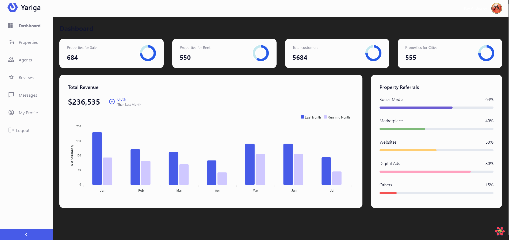

# Full Stack MERN Application With CRUD, Auth, and Charts Using Refine dashboard

<div align="center" >
<!-- link to project -->
    <a href='-URL TO DEMO GOES HERE-'>
    <!-- link to local image -->
        
    </a>

**Link to project:** http://recruiters-love-seeing-live-demos.com/
<br>
<br>

<p>
<a href="https://github.com/rayanthoney/jm_refine_dashboard" target="_blank">

</a>
<a href="-URL DEMO GOES HERE-" target="_blank">

</a>
</p>
</div>

<br>

<div align="center">
    
</div>

<br>

- [Build and Deploy a React Admin Dashboard App With Theming, Tables, Charts, Calendar, Kanban and More](https://youtu.be/jx5hdo50a2M)
  - [GitHub Code (give it a star ⭐) :](https://github.com/adrianhajdin/project_syncfusion_dashboard)
  - [Assets, Components, Public folders:](https://www.youtube.com/redirect?event=video_description&redir_token=QUFFLUhqblR4cWRYV2p2S0loVl90czFQU1F2OGZ1M28yZ3xBQ3Jtc0tsQ21taDVadVpBVnFIMzRWaFhtVHczVHZEWlBjajNQdzM5S3JWR292ODFsbTl1MXFPSlJnTXlQcXJpSDBpMk44endDT1poQzY0VllmMFdkOXBlRl94dDdSeVVTYmhNM2Q0UFdIRTFMWnU5bTd3WFIzRQ&q=https%3A%2F%2Fminhaskamal.github.io%2FDownGit%2F%23%2Fhome%3Furl%3Dhttps%3A%2F%2Fgithub.com%2Fadrianhajdin%2Fproject_syncfusion_dashboard%2Ftree%2Fmain%2Fsrc%2Fdata&v=jx5hdo50a2M)
  - [GitHub Gist Code:](https://gist.github.com/adrianhajdin/7d0eea1cbab4ab21a69dc8c2faf9b831)

<br>

## Technologies Used:

Here's where you can go to town on how you actually built this thing. Write as much as you can here, it's totally fine if it's not too much just make sure you write _something_. If you don't have too much experience on your resume working on the front end that's totally fine. This is where you can really show off your passion and make up for that ten fold.

<br>

<p align="center">
  <a href="https://skillicons.dev">
    
  </a>
</p>

<br>
<br>

```terminal
 > npx create-create-app ./
```

## Install Tailwind CSS

> Install tailwindcss and its peer dependencies, then generate your tailwind.config.js and postcss.config.js files.

```terminal
 > npm install -D tailwindcss
 > npx tailwindcss init -p
```

## Installing Your Packages

```terminal
  > npm install --legacy-peer-deps
```
