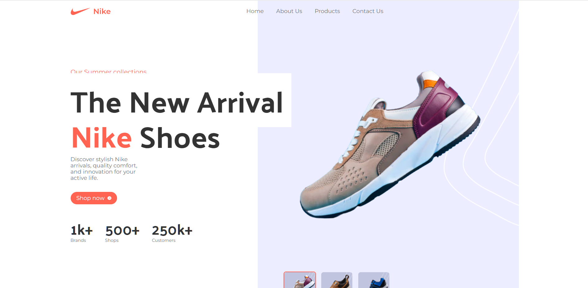

# Nike Website React.js Tailwind Template

<!-- link to project -->
    <a href='-URL TO DEMO GOES HERE-'>
    <!-- link to local image -->
        
    </a>

**Link to project:** http://recruiters-love-seeing-live-demos.com/

 

    
    <h3>JavaScript Mastery</h3>    
    
A facere qui dolorum volupta <b>bold-text</b> Suscipit assumenda, <b>bold-text</b> Lorem ipsum dolor sit amet consectetur, adipisicing elit. Suscipit assumenda, corporis fuga facere qui dolorum voluptatem molestias obcaecati veritatis debitis!

    <h3>::</h3>

   

- [Tailwind CSS Full Course 2023 | Build and Deploy a Nike Website](https://youtu.be/tS7upsfuxmo?si=2YbHIFEAa485518G)
  - [GitHub Code (give it a star ⭐):](https://github.com/adrianhajdin/nike_landing_page)
  - [Assets, Components, Public folders:](https://drive.google.com/file/d/1ccqjc8gJ7CLvXT_vUhVT4Gmys-Ze13FK/view?pli=1)
  - [GitHub Gist Code:](https://gist.github.com/adrianhajdin/ae10e2dd6ee5d51fc5b31437f73cf014)

 

In this course, you'll learn the following:

- TailwindCSS - a popular utility-first CSS styling framework
- Vite - consectetur adipisicing elit. Fugiat quae tempora fugit veniam dolore eos ab cum odio ea delectus?
- React - consectetur adipisicing elit. Fugiat quae tempora fugit veniam dolore eos ab cum odio ea delectus?
- NodeJS - consectetur adipisicing elit. Fugiat quae tempora fugit veniam dolore eos ab cum odio ea delectus?
- Javascript - consectetur adipisicing elit. Fugiat quae tempora fugit veniam dolore eos ab cum odio ea delectus?
- CSS - consectetur adipisicing elit. Fugiat quae tempora fugit veniam dolore eos ab cum odio ea delectus?
- HTML consectetur adipisicing elit. Fugiat quae tempora fugit veniam dolore eos ab cum odio ea delectus?
- Lorem ipsum dolor sit amet, consectetur adipisicing elit. Fugiat quae tempora fugit veniam dolore eos ab cum odio ea delectus?

## Technologies Used:

Here's where you can go to town on how you actually built this thing. Write as much as you can here, it's totally fine if it's not too much just make sure you write _something_. If you don't have too much experience on your resume working on the front end that's totally fine. This is where you can really show off your passion and make up for that ten fold.

 

  

    
  

## Optimizations

_(optional)_

You don't have to include this section but interviewers _love_ that you can not only deliver a final product that looks great but also functions efficiently. Did you write something then refactor it later and the result was 5x faster than the original implementation? Did you cache your assets? Things that you write in this section are **GREAT** to bring up in interviews and you can use this section as reference when studying for technical interviews!

## Lessons Learned:

No matter what your experience level, being an engineer means continuously learning. Every time you build something you always have those _whoa this is awesome_ or _fuck yeah I did it!_ moments. This is where you should share those moments! Recruiters and interviewers love to see that you're self-aware and passionate about growing.

## Examples:

Take a look at these couple examples that I have in my own portfolio:

**Palettable:** https://github.com/alecortega/palettable

**Twitter Battle:** https://github.com/alecortega/twitter-battle

**Patch Panel:** https://github.com/alecortega/patch-panel

**Patch Panel:** https://github.com/alecortega/patch-panel