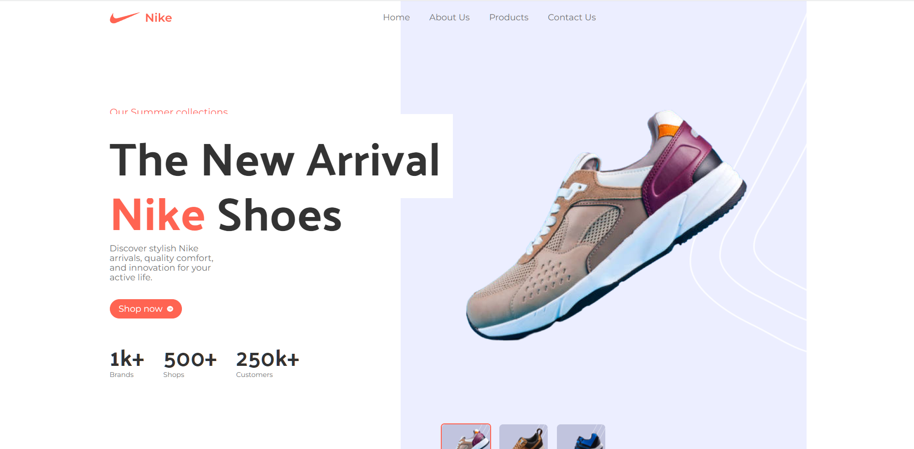

# Nike Website React.js Tailwind Template

<div align="center" >
<!-- link to project -->
    <a href='-URL TO DEMO GOES HERE-'>
    <!-- link to local image -->
        
    </a>

**Link to project:** http://recruiters-love-seeing-live-demos.com/

<p>
<a href="https://github.com/rayanthoney/jm_3d_portfolio" target="_blank">

</a>
<a href="-URL DEMO GOES HERE-" target="_blank">

</a>
</p>
</div>

<br>

<div align="center">
    
    <h3>JavaScript Mastery</h3>    
    <p>A facere qui dolorum volupta <b>bold-text</b> Suscipit assumenda, <b>bold-text</b> Lorem ipsum dolor sit amet consectetur, adipisicing elit. Suscipit assumenda, corporis fuga facere qui dolorum voluptatem molestias obcaecati veritatis debitis!</p>

  <h3>::</h3>
  <br>

- [Build and Deploy an Amazing 3D Web Developer Portfolio in React JS | Beginner Three.js Tutorial](https://youtu.be/tS7upsfuxmo?si=HqhSlBCZ_6Wv_6dx)
  - [GitHub Code (give it a star ⭐):](https://github.com/adrianhajdin/project_3D_developer_portfolio)
  - [Assets, Components, Public folders:](https://drive.google.com/drive/folders/1KVU8iaH0E_JFtShNiR3BgCSA3pawXY4Z)
  - [GitHub Gist Code:](https://gist.github.com/adrianhajdin/b1d33c262941a7e21aad833a1cfc84b1)

<br>

In this course, you'll learn the following:

- TailwindCSS - a popular utility-first CSS styling framework
- Vite - consectetur adipisicing elit. Fugiat quae tempora fugit veniam dolore eos ab cum odio ea delectus?
- React - consectetur adipisicing elit. Fugiat quae tempora fugit veniam dolore eos ab cum odio ea delectus?
- NodeJS - consectetur adipisicing elit. Fugiat quae tempora fugit veniam dolore eos ab cum odio ea delectus?
- Javascript - consectetur adipisicing elit. Fugiat quae tempora fugit veniam dolore eos ab cum odio ea delectus?
- CSS - consectetur adipisicing elit. Fugiat quae tempora fugit veniam dolore eos ab cum odio ea delectus?
- HTML consectetur adipisicing elit. Fugiat quae tempora fugit veniam dolore eos ab cum odio ea delectus?
- Lorem ipsum dolor sit amet, consectetur adipisicing elit. Fugiat quae tempora fugit veniam dolore eos ab cum odio ea delectus?

## Technologies Used:

Here's where you can go to town on how you actually built this thing. Write as much as you can here, it's totally fine if it's not too much just make sure you write _something_. If you don't have too much experience on your resume working on the front end that's totally fine. This is where you can really show off your passion and make up for that ten fold.

<br>

<p align="center">
  <a href="https://skillicons.dev">
    
  </a>
</p>

## How was this Built

- TailwindCSS - a popular utility-first CSS styling framework
- 
- 
- 

<br>
<br>

```terminal
 > npm create vite@latest ./ -- --template react
```

## Install Tailwind CSS

> Install tailwindcss and its peer dependencies, then generate your tailwind.config.js and postcss.config.js files.

```terminal
 > npm install -D tailwindcss
 > npx tailwindcss init -p
```

## Installing Your Packages

```terminal
  > npm install --
```
