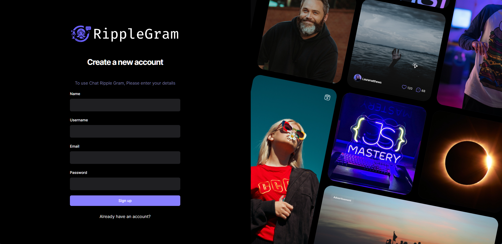

# Build and Deploy a Full Stack Social Media App | React JS, Appwrite, Tailwind CSS, React Query.

<!-- link to project -->
    <a href='-URL TO DEMO GOES HERE-'>
    <!-- link to local image -->
        
    </a>

**Link to project:** http://recruiters-love-seeing-live-demos.com/
 
 

 

    

 

- [Build and Deploy a Full Stack Social Media App | React JS, Appwrite, Tailwind CSS, React Query (TanStack).](https://youtu.be/_W3R2VwRyF4?si=GHAh9hre288av2Zw)
  - [GitHub Code (give it a star ⭐) :](https://github.com/adrianhajdin/social_media_app)
  <!-- - [Assets, Components, Public folders:](https://drive.google.com/file/d/1KsXjkJoyV7sFka_EiKOWD1BMAzf1B2sa/view) -->
  - [GitHub Gist Code:](https://gist.github.com/adrianhajdin/4d2500bf5af601bbd9f4f596298d33ac)

 

## Technologies Used ::

 

  

 
 

## Some Key Features::

- Introduction to a social media app project focusing on modern UI, native mobile feel, and specific tech stack (<strong>React</strong> <strong>JS,</strong> <strong>Appwrite,</strong> <strong>Tailwind</strong> <strong>CSS,</strong> <strong>React Query</strong>).
- Emphasis on eliminating complexities in server setup, security, user handling, and optimizing API performance using <strong>Appwrite</strong> for hassle-free backend.
- Building signup forms, leveraging <strong>Chakra UI</strong> styling, ensuring type-safe client-side validation, and incorporating navigation links for login.
- Integration of database connections, user creation, and addition of user information (email, bio, image ID) using <strong>Appwrite</strong>.
- Implementation of various features including post creation, submission logic, post rendering with details (created at, location, tags), and exploration page planning with infinite scroll and search functionality.
 
 

## Optimizations

_(optional)_

You don't have to include this section but interviewers _love_ that you can not only deliver a final product that looks great but also functions efficiently. Did you write something then refactor it later and the result was 5x faster than the original implementation? Did you cache your assets? Things that you write in this section are **GREAT** to bring up in interviews and you can use this section as reference when studying for technical interviews!

## Lessons Learned:

No matter what your experience level, being an engineer means continuously learning. Every time you build something you always have those _whoa this is awesome_ or _fuck yeah I did it!_ moments. This is where you should share those moments! Recruiters and interviewers love to see that you're self-aware and passionate about growing.

## Examples:

Take a look at these couple examples that I have in my own portfolio:

**Palettable:** https://github.com/alecortega/palettable

**Twitter Battle:** https://github.com/alecortega/twitter-battle

**Patch Panel:** https://github.com/alecortega/patch-panel

**Patch Panel:** https://github.com/alecortega/patch-panel