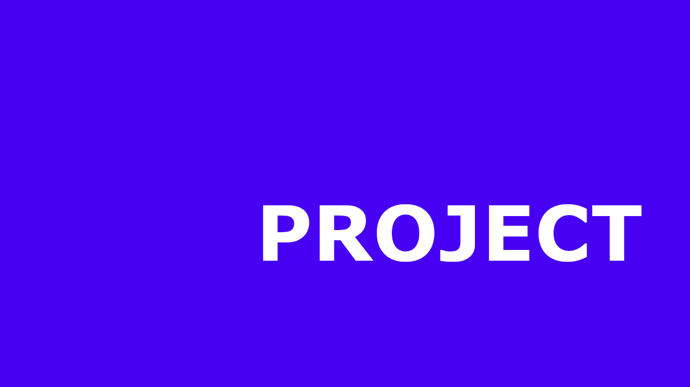

<!-- # React + Vite

This template provides a minimal setup to get React working in Vite with HMR and some ESLint rules.

Currently, two official plugins are available:

- [@vitejs/plugin-react](https://github.com/vitejs/vite-plugin-react/blob/main/packages/plugin-react/README.md) uses [Babel](https://babeljs.io/) for Fast Refresh
- [@vitejs/plugin-react-swc](https://github.com/vitejs/vite-plugin-react-swc) uses [SWC](https://swc.rs/) for Fast Refresh -->

# Build and Deploy an Amazing 3D Developer Portfolio in React with Three.js

<!-- link to project -->
    <a href='-URL TO DEMO GOES HERE-'>
    <!-- link to local image -->
        
    </a>

**Link to project:** http://recruiters-love-seeing-live-demos.com/
 
 

 

    

 

- [Build and Deploy an Amazing 3D Developer Portfolio in React with Three.js](https://youtu.be/FkowOdMjvYo?si=1pWS_0zWeSJmwGpw)
  - [GitHub Code (give it a star ⭐) :](https://drive.google.com/file/d/1TACDN8qFpi_NW66I4p48R9_MUmx-JT3P/edit?pli=1)
  - [Assets, Components, Public folders:](https://drive.google.com/file/d/1KsXjkJoyV7sFka_EiKOWD1BMAzf1B2sa/view)
  - [GitHub Gist Code:](https://gist.github.com/adrianhajdin/7bc0603ee0b1bd2872b80a62c24b5e5f)

 

**Patch Panel:** https://github.com/alecortega/patch-panel

**Patch Panel:** https://github.com/alecortega/patch-panel